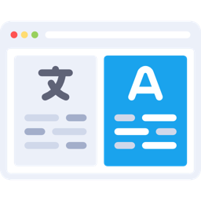
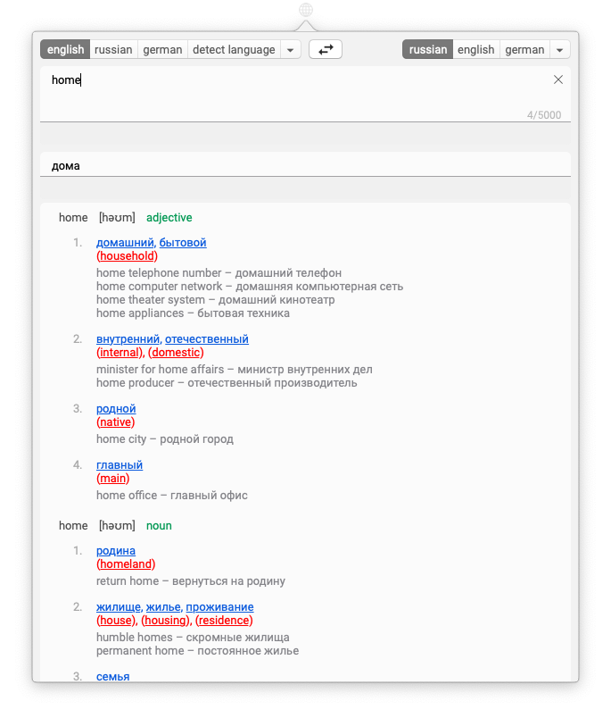
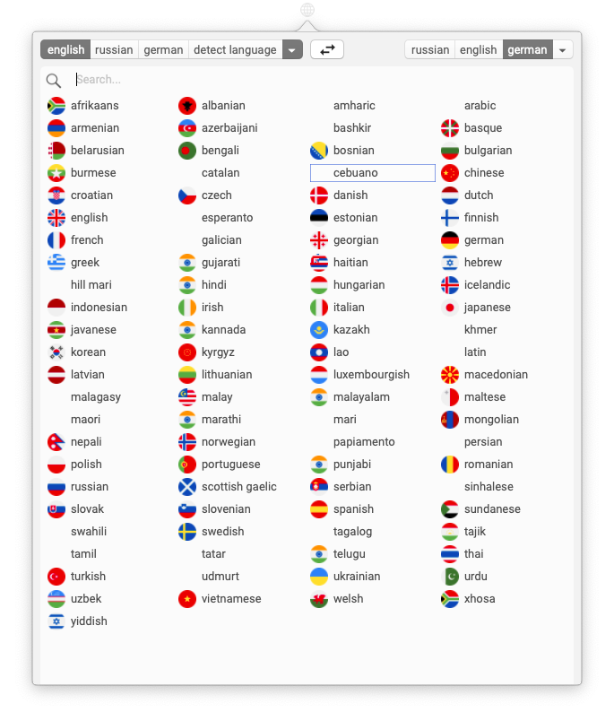

# Translate Bar

<p align="center">
  
</p>

<p align="center">
    <a href="https://github.com/artbobrov/Translate-Bar/blob/master/LICENSE.md">
        
    </a>
    <a href="https://travis-ci.com/artbobrov/Translate-Bar">
        
    </a>
    <a href="https://app.codacy.com/app/artbobrov/Translate-Bar?utm_source=github.com&utm_medium=referral&utm_content=artbobrov/Translate-Bar&utm_campaign=badger">
        
    </a>
</p>

Translate Bar is an macOS app that allows you to translate text directly from your menu bar. Open-source appliction written in Swift using some third party libraries:
* RxSwift
* Moya
* ITSwitch
* KeyHolder

Translation was implemented via [Yandex Translate API](https://tech.yandex.com/translate/)

## Download
Download latest version of the application for [macOS](https://github.com/artbobrov/Translate-Bar/releases)

## Building 
Translate Bar uses [CocoaPods](https://github.com/CocoaPods/CocoaPods/) as a dependency manager and [Cocoapods-Keys](https://github.com/orta/cocoapods-keys) to store application keys.

1. Clone project from Github to your local
```
git clone https://github.com/artbobrov/Translate-Bar.git
```
2. Get your [Yandex Dictionary API key](https://tech.yandex.com/dictionary/) and [Yandex Translate API key](https://tech.yandex.com/translate/)
3. Install all pods and save Yandex API keys
Run
```
$ pod install
CocoaPods-Keys has detected a keys mismatch for your setup.
What is the key for YandexDictionaryKey
 > YOUR_YANDEX_DICTIONARY_API_KEY

Saved YandexDictionaryKey to Translate Bar.
What is the key for YandexTranslateKey
 > YOUR_YANDEX_TRANSLATE_API_KEY
Saved YandexTranslateKey to Translate Bar.
Analyzing dependencies
Fetching podspec for `Keys` from `Pods/CocoaPodsKeys`
Downloading dependencies
Installing Alamofire (4.7.3)
Installing ITSwitch (1.0)
Installing KeyHolder (3.0.1)
Using Keys (1.0.1)
Installing Magnet (2.3.1)
Installing Moya (11.0.2)
Installing Result (3.2.4)
Installing RxAtomic (4.4.0)
Installing RxCocoa (4.4.0)
Installing RxSwift (4.4.0)
Generating Pods project
Integrating client project
Sending stats
Pod installation complete! There are 8 dependencies from the Podfile and 11 total pods installed.
```
or later
```
pod keys set "YandexDictionaryKey" "YOUR_YANDEX_DICTIONARY_API_KEY"
pod keys set "YandexTranslateKey" "YOUR_YANDEX_TRANSLATE_API_KEY"
```
4. Just run your app in Xcode

## Screenshots


